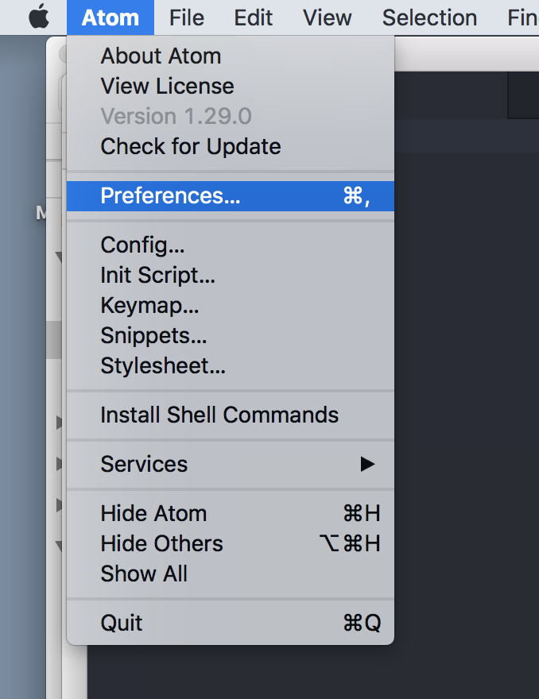
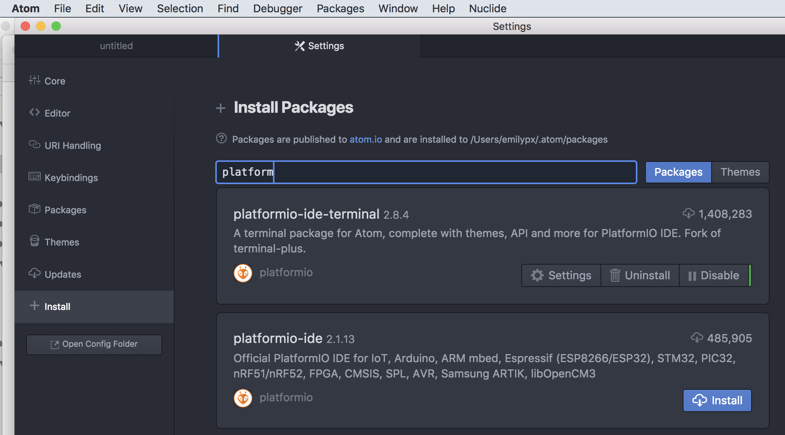

# Problem Set 1 (continued)

## Due Friday, January 17 @ 11:59pm

## If you run into problems, see the problems.md file in this repository.

**Note: It's really important that you follow the instructions exactly. You'll be happy you did!**

---

### Part 4: Download and install Java 8 SE Development Kit

1. You might already have some components of Java installed on your computer. Unless you have a very good reason for keeping other versions of Java around, I recommend that you uninstall all existing versions of both the JRE and the JDK (a.k.a., the Java SE Development Kit) from your computer.

* Mac OS:
    First [Uninstall JRE](https://www.java.com/en/download/help/mac_uninstall_java.xml). Then
    [Uninstall JDK](https://docs.oracle.com/javase/8/docs/technotes/guides/install/mac_jdk.html#A1096903).

* Windows:
  [Uninstall both JRE and JDK using Windows uninstaller](https://www.java.com/en/download/help/uninstall_java.xml)


2. As of mid-2019, Oracle requires you to have an Oracle account to download Java. If you don't already have an Oracle account, [you can create one here](https://profile.oracle.com/myprofile/account/create-account.jspx). You can just make up a phone number or address, but you will need your real email address to confirm the account, and you'll need to save your password. Go to your email to find the account confirmation email, follow the link, then proceed to step 3.

3. Although there are several newer versions of Java, **we'll be using Java 8**. Select the radio button for the Java SE Development Kit 8u231 for your operating system from [here](https://www.oracle.com/technetwork/java/javase/downloads/jdk8-downloads-2133151.html). If you do not know which kind of Windows you have, see below under Windows 10 users. Don't forget to click the radio button indicating that you agree to the terms of the license, then click Download, log into Oracle, and your download will start.

4. After you download the .dmg (Mac) or .exe (Windows), double-click it to start the installation. Click as needed to complete the installation. Do not try to change the location Java gets installed to. Just let the installer put Java where it likes.

### Part 5: Configure and validate Java installation

[Click here for Windows](#windows-users)

[Click here for Mac](#mac-users)

#### <a name="windows-users"></a> Windows 10 Users

*If you are using Windows 7, proceed at your own risk.*

1. I am assuming you have deleted *all* copies of Java from your computer by using the [special Java uninstall tool for Windows here](https://www.java.com/en/download/help/uninstall_java.xml). If not, you can give these instructions a try, but if they don't work, go back to Part 4 above and follow those directions.


2. If you didn't know which Java 8 to install in Part 4, determine whether you have 64 bit (x64)or 32 bit (x86) Windows by following [the directions for Windows 10 here](https://www.wikihow.com/Check-if-Your-Computer-Is-64-Bit). Then following the instructions in Part 4 for downloading and installing the SDK (make sure it’s the SDK!) [from here again](https://www.oracle.com/technetwork/java/javase/downloads/jdk8-downloads-2133151.html) making sure to select x64 or x86 depending on your system. Do not try to change the location Java gets installed to. Just let the installer put Java where it likes, and make a note of the location.

3. Quit any ``cmd`` terminals you have open, and quit Atom, if you have it open.

4. Just repeating this here: quit any ``cmd`` terminals you have open and quit Atom if you have it open.

5. Make sure that you have the path to the Java sdk bin directory *exactly* right as follows: (a) navigate in your file system (using Explorer, or whatever it’s called in Windows) to the location where the Java `bin` folder was installed (e.g., `C:\Program Files\Java\jdk1.8.0_201\bin`). **MAKE SURE IT'S JDK and not JRE!!!** (b) Right-click on the `\bin` fodler and choose `Properties`. (c) The path is shown next to the Location header, which you must now highlight and copy.

6. Launch ``Control Panel -> (Optional) System and Security -> System``. 

7. Click ``Advanced system setting`` in the left pane.

8. Select the ``Advanced`` tab, and click ``Environment Variables`` button.

9. Under ``System Variables`` (the bottom pane), the scroll down to select ``Path``, then select ``Edit...``.

10. In Windows 10, you will see a table listing all the existing ``PATH`` entries.  Click ``New`` then paste in what you copied in step 5. If it does not end in `\bin` then add `\bin` to the end, e.g., `C:\Program Files\Java\jdk1.8.0_231\bin`. Make sure it has `\bin`. Make sure it does not have `jre` in it. Onyl `jdk` will work.

11. Look at the rest of the entries in the path variable. If you see any entry with the word "java" or "Java" or "jre" in it anywhere at all, delete that entry.

12. Save and close that window. Look in the list of environment variables, and if you see a JAVA_HOME variable in your environment variables, delete it.

13. Open a CMD shell by clicking the ``Start`` button, then selecting ``Windows System -> Command Prompt``.

14. Type ``java -version`` and you should see something like this:

```java

java version "1.8.0_231"
Java(TM) SE Runtime Environment (build 1.8.0_231-b11)
Java HotSpot(TM) 64-Bit Server VM (build 25.231-b11, mixed mode)

```

15. Type ``javac -version`` and you should see something like this:

```java

javac 1.8.0_231

```

If you get an error message (e.g., "command java not found") or if the number after `javac` or `java version` is not `8` (e.g., `java 1.7`, then something is not right. Go back to the top and start again, this time remembering to follow the instructions carefully.

#### <a name="mac-users"></a> Mac Users
1. Launch a Terminal. You can do this by finding the Terminal app in your Applications folder, or by going up to the magnifying glass in the upper right corner of your screen and then searching for Terminal.

2. At the prompt in Terminal, type ``java -version`` and you should see something like this:

```java

java version "1.8.0_231"
Java(TM) SE Runtime Environment (build 1.8.0_231-b11)
Java HotSpot(TM) 64-Bit Server VM (build 25.231-b11, mixed mode)

```


3. Type ``javac -version`` and you should see something like this:

```java

javac 1.8.0_231

```

4. If you get an error message (e.g., "command java not found") or if the number after `javac` or `java version` is not `1.8`  then something is not right. Go back to the top and start again, this time remembering to follow the instructions carefully.


### Part 6: Install and configure Atom

If you have never used Java before, I recommend that you use Atom to write and compile your code for this class. If you have used IntelliJ or Eclipse or another IDE in the past for Java development, you can continue to do so, but I will provide support only for Atom. If you decide to use Atom, follow these instructions to install and configure Atom.


1. [Download Atom](https://atom.io). Double click the downloaded file to unzip it (if necessary), then move Atom **out of your Downloads folder** to a place on your computer where it will be easy to find (e.g., in the Applications folder or on your desktop).

2. Launch Atom. There are a few tabs or frames that open automatically, which you can close by clicking the "X" in the upper right corner of the tab or frame. (If all these windows keep popping up when start Atom, you can disable them.)

3. You now need to install an Atom package that will customize Atom for use in this class. From Atom's menu bar, click the Atom menu, and then select Preferences to open the Settings menu.



4. On the left of the Settings area, you’ll see a menu with items like Core, Editor, URI Handling, and so on. Click on the menu item that says Install, which has a plus-sign icon next to it.



5. In the search box that appears, enter ``platformio-ide-terminal``. Click Install button for ``platform-ide-terminal``, and wait for installation to complete.


### Part 7: Get a local copy of the repository from GitHub 

We will be using git and GitHub to distribute and collect problem sets. Using GitHub is **not** optional. GitHub and git are  used by millions of software developers at major companies around the world. An important component of this class and of your development as a computer scientist is understanding how to use git and GitHub.

1. Start by creating a folder on your computer for this class called ``CS2`` or ``CS1102``. I have mine on my Desktop so it's easy to find, but you are free to put it wherever is convenient for you.

2. Look up at the top of this webpage you are on right now, and locate the green ``Clone or download`` on the right. Click that button, and then copy the the URL beginning with ``https://`` that appears, which will look something like this, below:


3. In Atom, go to ``Packages -> Command Palette -> Toggle``.

4. In the pop-up window that opens, start typing ``GitHub``, and the GitHub: commands will appear. Select ``GitHub: Clone``.

5. Paste the URL from Part 1 in the first box, and the path to the **course folder** you created to Part 1 followed by the name of your respository in the second box. Here's what the box looks like on my computer. You can see that the repository URL ends in `ps1.git`, while the destination directory ends in `ps1`. Yours will look similar, except the repository URL will end in `ps1-yourusername.git`, and you should choose a directory on your computer that ends in `ps1-yourusername`.


6. Click the ``Clone`` button. This will copy your personal `ps1-yourusername` repository to your computer. If you get an error message in red letters, you are probably not following the directions, so try again!

**NOTE:** If you end up with an empty repository following these instructions, [use the GitHub Desktop app](https://desktop.github.com) to do your cloning and your other GitHub activities, as needed. You are free to use the GitHub Desktop application for this class.


### Part 8: Edit a file and push edits to GitHub

1. If you did Part 7 correctly, you should see the contents of the repository in Atom. If you can't see the ``ps1-yourusername`` repository, then go to `File -> Open`, and navigate to your class folder, where you should find your local respoitory. Select `ps1-yourusername`  and click ``Open``. **Do not select your class folder or the `src` folder!** 

2. You should now see something like this, below, with a tree structure showing the files in your current directory in the left pane and an empty pane on the right. (Feel free to close any of the pesky Welcome tabs and panes that Atom likes to open up.)


3. Click on ``src`` to view the code for this assignment, then click on ``HelloWorld.java``. Code will appear in the panel on the right. Find where you see this in the code:

```java
System.out.println("Hello, World!")
```

Replace the words ``Hello, World!`` with your favorite greeting.

4. From the ``File`` menu, select ``Save`` (or use your usual keyboard shortcut for saving, like command-s in MacOS or control-s in Windows).

5. Go to ``Packages -> GitHub -> Toggle Git Tab``.

6. The Git tab will open, and you'll see something like this, below. Click ``Stage all``.


7. Type a comment explaining what you did and why where it says ``Commit message``.

8. Click ``Commit to master``.

9. Click the ``Push`` on the right in the bottom menubar, between ``master`` and ``files``. **This is the part people always forget, so don't forget!**

10. Go to GitHub and confirm that your respository has been updated. You should see the changes reflected in your problem set repository and see ``last updated 1 minute ago`` (or thereabouts). This is what we will grade. Congratulations! 

